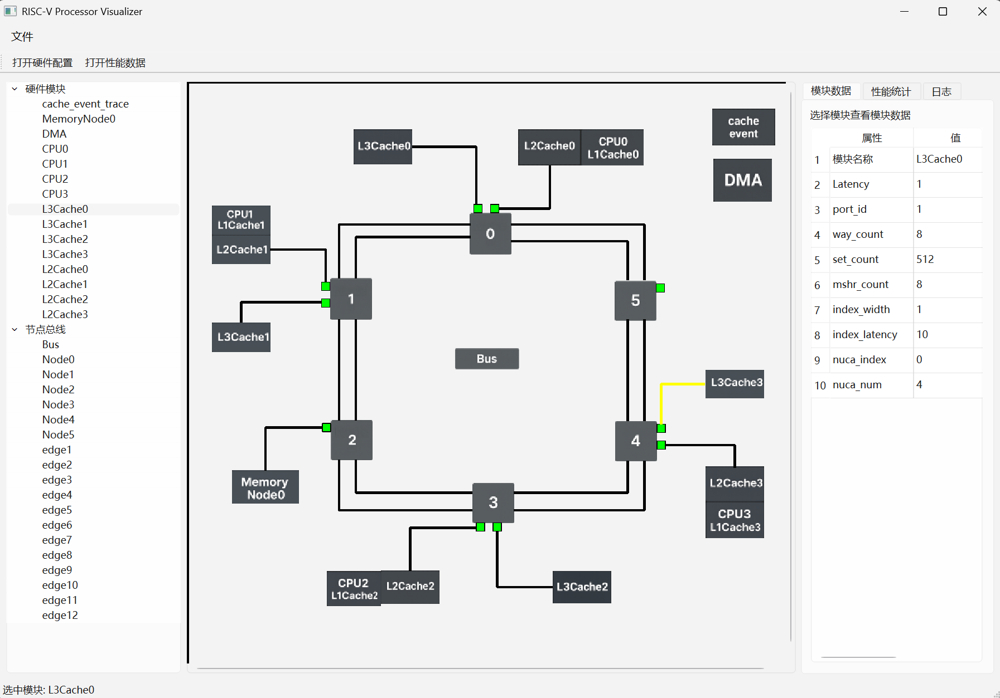

## 🧠 ProcessorVisualizer

一个使用 Qt 开发的图形化处理器结构与性能可视化工具，支持展示模块拓扑结构、统计数据、性能指标及详细交互信息。

------

### 🔧 项目特点

- **模块拓扑可视化**：基于 `setup.txt` 文件绘制处理器结构图。
- **交互式信息查看**：点击模块、端口、连线可查看对应数据。
- **多页签数据展示**：支持模块参数与性能统计分标签页展示，基于 `statistic.txt` 。
- **从文件动态加载数据**：
  - CPU 模块：`CPU_statistics.txt`
  - Cache 模块：`Cache_statistics.txt`
  - Bus 模块：`Bus_statistics.txt`
  - Node 模块：`Node_statistics.txt`
  - Edge 模块：`Edge_statistics.txt`
  - Cache 事件追踪分析：`cache_event_trace_statistics.txt`

------

### 📂 项目结构（使用 QT 打开）

```
├── Source Files/
│   ├── main.cpp
│   ├── mainwindow.cpp
│   └── processor_visualizer.cpp
├── Header Files/
│   ├── mainwindow.h
│   ├── processor_visualizer.h
├── resources/
│   └── prefix/statistics/
│       ├── CPU_statistics.txt
│       ├── Cache_statistics.txt
│       ├── Bus_statistics.txt
│       ├── Node_statistics.txt
│       ├── Edge_statistics.txt
│       ├── Port_statistics.txt
│       └── cache_event_trace_statistics.txt
│   └── prefix/images/
│       ├── bus.png
│       ├── DMA.png
│       ├── ...
├── Forms/
│   └── mainwindow.ui
├── README.md
├── setup.txt     //可供使用的数据
├── statistic.txt     //可供使用的数据
├── concept_map.png     //概念图
├── example.png     //运行示例图
└── CMakeLists.txt
```

------

### 🚀 使用方法

#### 下载项目

下载全部文件即可。

#### 构建项目

使用 Qt Creator 打开  `CMakeLists.txt` 项目文件，然后构建运行即可。

#### 操作说明

- **模块（端口）点击**：
  - 左键点击端口：展示端口编号。
  - 右键点击端口：选择两个端口进行对比分析。
  - 左键点击模块：在页签界面展示模块数据。
- **信息展示**：
  - 页面分为两个标签页，分别显示模块结构参数与运行性能。
  - 点击模块后自动切换到页签，并填充对应内容。
- **数据加载**：
  - 程序启动时需手动加载拓扑结构与统计数据。例如，项目结构中的 `setup.txt` 与 `statistic.txt` 。
  - 所有模块数据都来自 `:/prefix/statistics/` 路径下的资源文件。
  - 所有模块图片都来自 `:/prefix/images/` 路径下的资源文件。

------

### 📌 技术栈

- **C++ / Qt 6**
- **QGraphicsView / QGraphicsItem 可视化绘制**
- **动态交互 / 信号槽机制**
- **资源内嵌 / 分页展示**

------

### 📸 示例截图


